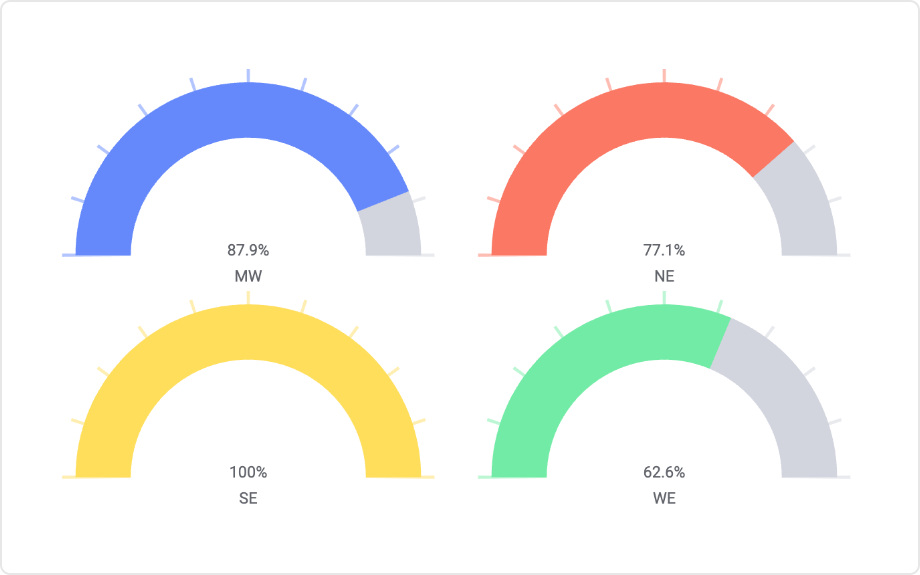

# Gauge Mod for Spotfire®

A configurable visualization for gauge reading using a radial scale to display a specific data point using a dial over a radial scale with defined limits.

Gauges can be used for many purposes like speed, satisfaction, volume, temperature, etc. But most common use is from car dashboard for fuel, speed, etc. also known as speedometer.

## Installation & Use

[Download latest version](https://github.com/spotfiresoftware/spotfire-mod-gauge/releases)

The [Wiki](https://github.com/spotfiresoftware/spotfire-mod-gauge/wiki) contains step-by-step instruction on how to install and use this Mod in Spotfire®.

## Building the Project

In a terminal window:
- `npm install`
- `npm start`

In a new terminal window:
- `npm run server`

## About Mods for Spotfire®
-   [TIBCO Community Exchange](https://community.tibco.com/s/global-search/%40uri#q=mod%20for%20tibco%20spotfire&t=Exchange&sort=date%20descending): A safe and trusted place to discover ready-to-use mods
-   [Developer documentation](https://tibcosoftware.github.io/spotfire-mods/docs/): Introduction and tutorials for mods developers
-   [Mods examples](https://github.com/TIBCOSoftware/spotfire-mods/releases/latest): A public repository for examples projects
